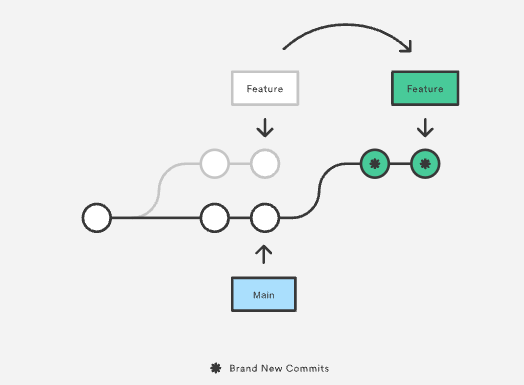
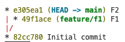
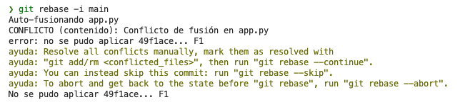
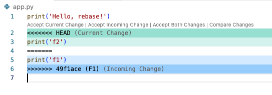
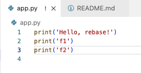
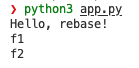
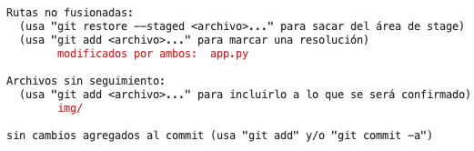
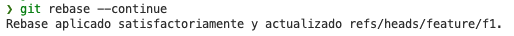
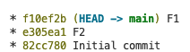

# Git Rebase Example



In the situation depicted below.



If we want to merge `feature/f1` into main, probably some conflict is going to appear. In the process depict below, let's use rebase in order to move the `49f1ace` commit to have the `e305ea1` commit as parent and also let's resolve any conflict in local. Let's start moving to `feature/f1` branch.

```bash
$ git sw feature/f1
```

Once the main branch is updated in local, let's start with the rebase

```bash
$ git rebase -i main
```

Now, it's time to fix the conflicts as is depicted below:



For instance:



Then, the correct way of resolve the conflicts is given below: 



Let's check our application is okay:



Then, let's add the modified files and commit them:



```bash
$ git add app.py
$ git commit -m "F1"
```

After commiting the conflict resolution, let's use continue:

```bash
$ git rebase --continue
```



Finally, let's merge into main branch and take a look at the tree:

```bash
$ git sw main
$ git merge feature/f1
$ git branch -D feature/f1
```


